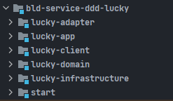
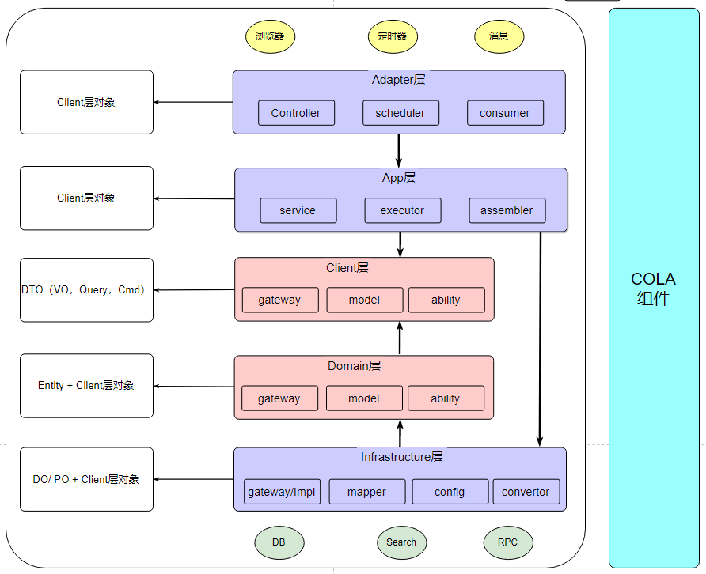

## 项目介绍

LuckyDraw是一个在线抽奖系统，旨在为用户提供公平、公正、公开的抽奖环境。用户参与各种活动可以获得抽奖机会，有机会赢取各种奖品。

### 技术栈

后端： JDK11+SpringBoot2.5+SpringCloud+Redis+RocketMQ+MySQL+Nacos+FastDFS+Hutool+lombok+Mapstruct+Jasypt+JWT+COLA架构

前端： Vue3+ElementPlus+Ecahrts+Axios

### 主要功能

其主体业务是围绕**抽奖**展开，其中主要实现功能有：

1、利用 COLA 架构将抽奖服务中的各个模块进行分层，使每层只需关注本层业务逻辑，很好的实现了业务逻辑解耦，系统代码也更加利于迭代和维护。

2、使用 Gateway 做系统统一请求入口，并通过网关的全局过滤器实现了用户IP访问的限流处理及每次请求的认证与续约功能。

3、使用 JWT 生成登录信息并将 token 字符串存入 Redis 实现用户登录功能。

4、采用模板方法的设计模式，将复杂的抽奖逻辑分成一个个通用的方法，针对不同的实现逻辑生成对应的实现类，方便后续的优化及维护。

5、采用缓存预热，对库存进行扣减提高抽奖接口吞吐量，并搭配 Redis + Lua 脚本保证扣减库存或回滚库存的原子性。

6、使用预订单 + RocketMQ + 定时回查方案实现中奖信息 100% 发放到用户账户中。

7、利用 AOP + Redis + 自定义注解实现分布式锁，其中实现包括上锁、解锁、续约、强制暂停业务线程等功能。

8.、使用echarts搭建前端实时可视化大屏，通过SSE技术实现服务端推送，利用多种Redis数据类型进行高效统计, 实现后台的实时监测。

9、采用双Token方案，前端配合axios配置响应拦截器，实现前端token无感刷新，优化用户体验。

10、集成Github等第三方登录功能，采用OAuth 2.0协议进行身份验证，使用户能够快速、安全地登录，提高用户体验。

11、采用SSE技术推送在线抽奖结果，同时后台采用定时任务扫描临期中奖记录，通过RocketMQ异步发送邮件通知。

## 项目架构

项目采用Alibaba Cola架构，主要模块如下：

1）适配层（adapter）：负责对前端展示（web，wireless，wap）的路由和适配，对于传统B/S系统而言，adapter就相当于MVC中的controller；

2）应用层（app）：主要负责获取输入，组装上下文，参数校验，调用领域层做业务处理，如果需要的话，发送消息通知等。层次是开放的，应用层也可以绕过领域层，直接访问基础实施层；

3）领域层（domain）：主要是封装了核心业务逻辑，并通过领域服务（Domain Service）和领域对象（Domain Entity）的方法对App层提供业务实体和业务逻辑计算。领域是应用的核心，不依赖任何其他层次；

4）基础实施层（Infrastructure）：主要负责技术细节问题的处理，比如数据库的CRUD、搜索引擎、文件系统、分布式服务的RPC等。此外，领域防腐的重任也落在这里，外部依赖需要通过gateway的转义处理，才能被上面的App层和Domain层使用。

5）外部接口层（client）：对外提供的功能API，如果外部模块需要使用本项目功能只需引用 client 中的 API 接口即可实现功能。

包

| 层             | 包                           | 说明                                       |
| -------------- | ---------------------------- | ------------------------------------------ |
| adapter        | web                          | 处理页面请求的Controller                   |
| app            | 业务功能包（user、order）    | 业务名                                     |
| app            | assembler                    | 将 entity 转为 vo                          |
| app            | command                      | 修改相关的执行逻辑                         |
| app            | query                        | 查询相关的执行逻辑                         |
| client         | api                          | 存放对外功能的api                          |
| client         | dto（data、query）           | 对外返回的对象及调用方传入的参数对象       |
| domain         | gateway                      | 防腐层，让 Infrastructure 层实现逻辑       |
| domain         | 业务功能包（entity、值对象） | 根据业务功能分包，包中存放业务实体及值对象 |
| infrastructure | convertor                    | 存放将 DO 转化为 entity的类                |
| infrastructure | config                       | 存放配置相关                               |
| infrastructure | gateway.impl                 | 实现 domain 层的 gateway 接口的实现类      |
| infrastructure | dataobject                   | 存放数据库对象的DO                         |
| infrastructure | mapper                       | mapper文件                                 |

本项目依赖及COLA架构实践图：

### 项目运行截图

主页面：

登录界面：

注册界面：

用户个人中心：

